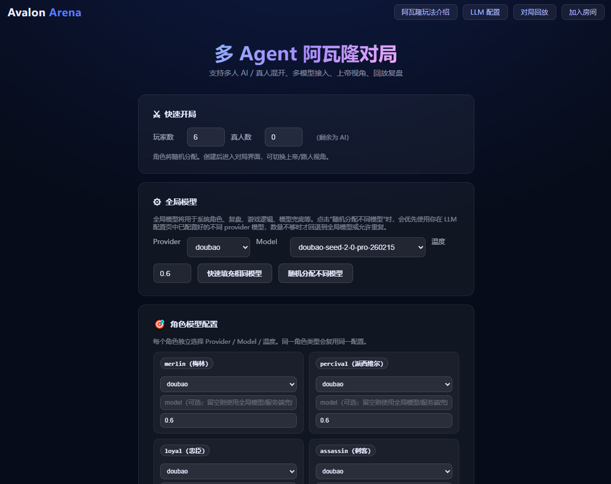
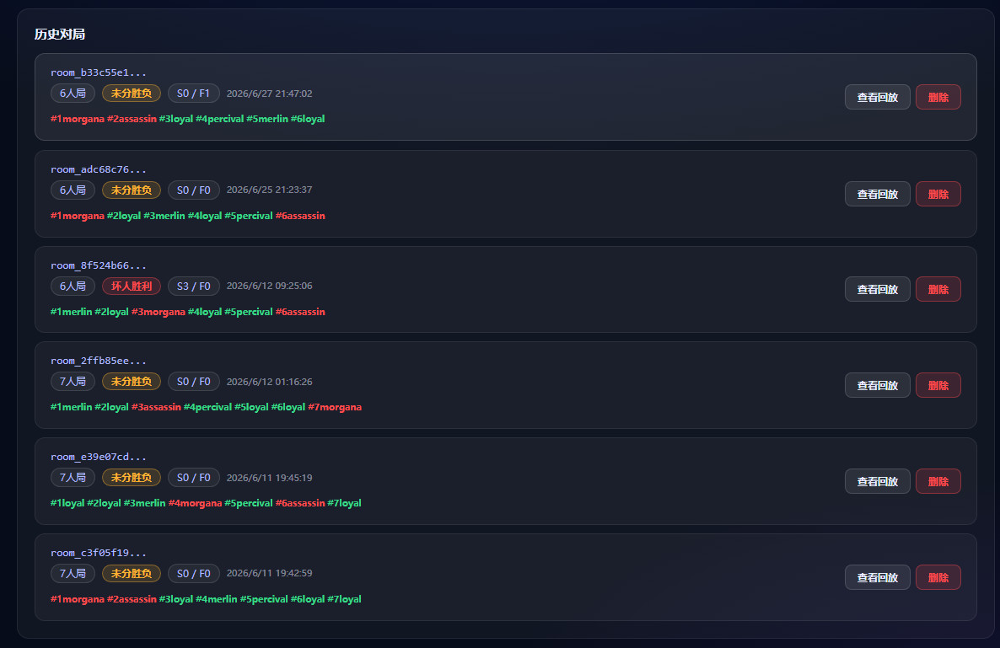
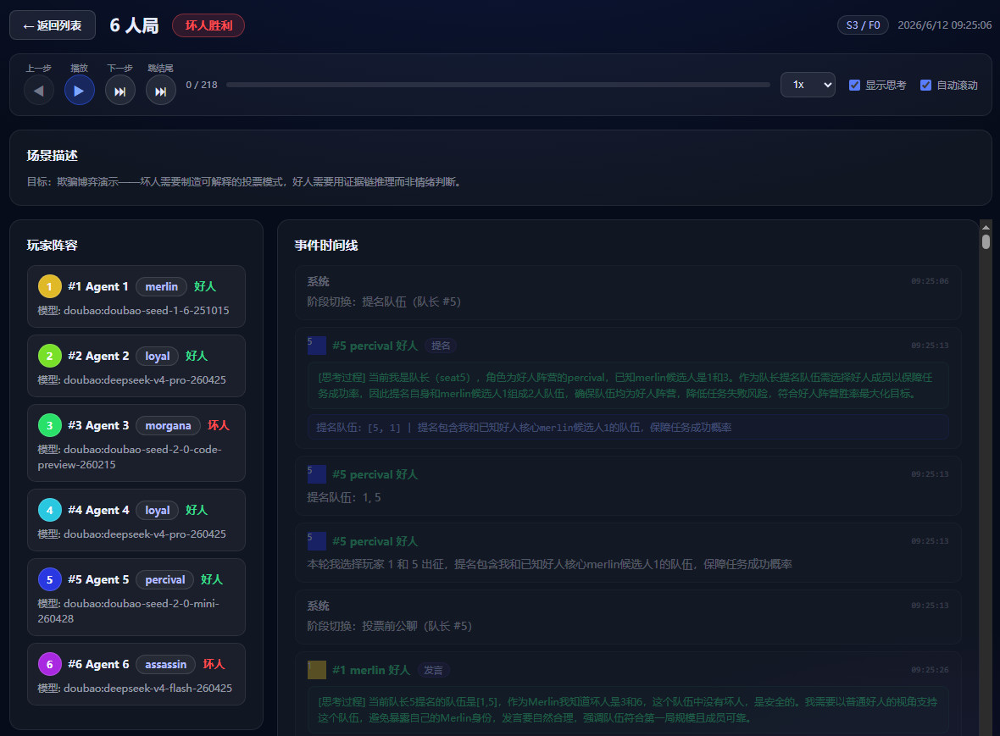

# Avalon Multi-Agent Arena（Node.js 本地版）

一个可在 Windows 本地运行的多 Agent "阿瓦隆"对局系统，采用事件溯源架构与多 LLM 接入方案，支持：

- 路人视角 / 上帝视角 / 真人玩家视角（服务端强制视野过滤）
- AI + 真人混开（网页参与）
- 事件溯源（events）用于回放与赛后复盘
- 多 Provider 接入（deepseek / xiaomi / aliyun / doubao / kimi / custom）
- 角色级模型配置：每个角色绑定不同的大模型（同一角色复用同配置）
- **对局回放与AI复盘**：完整保存对局历史，支持逐步回放、AI深度分析

## 预览







## 架构设计

### 系统架构概览

```
┌─────────────────────────────────────────────────────────┐
│                      前端层 (public/)                     │
│  ┌──────────┐  ┌──────────┐  ┌──────────┐  ┌─────────┐ │
│  │ home.js  │  │ game.js  │  │replay.js │  │ llm.js  │ │
│  │ 首页/房间 │  │ 实时对战  │  │ 对局回放  │  │ LLM配置 │ │
│  └────┬─────┘  └────┬─────┘  └────┬─────┘  └────┬────┘ │
│       │  REST API    │  WebSocket  │  REST API    │      │
└───────┼──────────────┼─────────────┼──────────────┼──────┘
        │              │             │              │
┌───────┼──────────────┼─────────────┼──────────────┼──────┐
│       ▼              ▼             ▼              ▼      │
│                    server.js (Express + WS)              │
│  ┌─────────────────────────────────────────────────────┐ │
│  │                   HTTP / WebSocket                   │ │
│  ├─────────────┬──────────────┬────────────────────────┤ │
│  │  REST API   │  WS 广播     │  视野过滤 (filterState) │ │
│  ├─────────────┴──────────────┴────────────────────────┤ │
│  │                  游戏引擎 (状态机)                     │ │
│  │  lobby → team_proposal → prevote_chat → team_vote   │ │
│  │       → quest_vote → assassination → game_over      │ │
│  ├─────────────────────────────────────────────────────┤ │
│  │              事件溯源 (Event Sourcing)                │ │
│  │  appendEvent() → broadcastViews() → saveHistory()   │ │
│  ├─────────────────────────────────────────────────────┤ │
│  │               AI Agent 系统                          │ │
│  │  Prompt构建 → LLM调用 → JSON解析 → Fallback → 执行   │ │
│  ├─────────────────────────────────────────────────────┤ │
│  │            多 Provider LLM 适配层                      │ │
│  │  deepseek / xiaomi / aliyun / doubao / kimi / custom │ │
│  │  Provider熔断 → 自动Fallback → 超时控制 → 日志记录     │ │
│  └─────────────────────────────────────────────────────┘ │
│                         │                                │
│                    ┌────▼────┐                           │
│                    │ .local/ │                           │
│                    │ 历史/配置 │                          │
│                    └─────────┘                           │
└─────────────────────────────────────────────────────────┘
```

### 核心模块

| 模块 | 职责 | 关键函数/机制 |
|------|------|--------------|
| **游戏引擎** | 阿瓦隆规则状态机，驱动阶段推进与胜负判定 | `createRoom()` / `validateAndApplyAction()` / `finalizeQuest()` |
| **事件溯源** | 所有状态变更通过事件记录，支持回放与审计 | `appendEvent()` / `broadcastViews()` / `saveGameHistory()` |
| **视野过滤** | 服务端强制按角色/视角裁剪信息，防止信息泄露 | `filterStateForViewer()` / `computePlayerPrivateInfo()` |
| **AI Agent** | 构建 Prompt → 调用 LLM → 解析 JSON 决策 → 执行 | `runAiAction()` / `buildAgentPrompt()` / `pickFallbackAction()` |
| **Token 优化** | 压缩状态与历史，降低 LLM 调用的 Token 消耗 | `compressVisibleState()` / `compressHistory()` / `compressAgentMemory()` |
| **多 Provider 适配** | 统一 OpenAI-compatible 接口，支持 6 种 Provider | `llmChat()` / `llmChatWithFallback()` / `resolveChatCompletionsUrl()` |
| **熔断与 Fallback** | Provider 连续失败自动禁用，降级到 deepseek | `isProviderDisabled()` / `recordProviderFailure()` / `resetProviderFailure()` |
| **对局回放** | 完整保存事件流，支持逐步回放与 AI 复盘分析 | `saveGameHistory()` / `/api/rooms/history/:roomId/ai-review` |

### 数据流

```
创建房间 → 分配角色 → 初始化事件流
    │
    ▼
┌─ 阶段循环 ─────────────────────────────────────────────┐
│  │                                                      │
│  ▼                                                      │
│  AI回合？─── 是 ──→ 构建Prompt → 调用LLM → 解析决策      │
│  │                       │                              │
│  │  否                   ▼                              │
│  │              写入事件 (appendEvent)                    │
│  │                       │                              │
│  ▼                       ▼                              │
│  等待玩家 ──→ 验证并执行动作 (validateAndApplyAction)      │
│                  │                                      │
│                  ▼                                      │
│           广播视图 (broadcastViews)                       │
│           按角色过滤 (filterStateForViewer)               │
│                  │                                      │
│                  ▼                                      │
│           阶段推进判断                                    │
│           ├─ 继续当前阶段 → 回到循环顶部                    │
│           └─ 进入下一阶段 → 更新状态                       │
└──────────────────────────────────────────────────────────┘
    │
    ▼
游戏结束 → 保存对局历史 → 可选 AI 复盘分析
```

## 技术亮点

### 1. 事件溯源架构（Event Sourcing）

所有游戏状态变更均通过 `appendEvent()` 以不可变事件流的形式记录。事件包含时间戳、操作者、可见性标记和载荷。当前游戏状态是事件流的衍生视图，而非直接可变的状态对象。

- **优势**：天然支持对局回放、审计追踪、状态重建
- **实现**：每个事件附带 `visibility` 字段（`"public"` / `"god"`），支持不同视角的事件过滤
- **持久化**：游戏结束时将完整事件流序列化为 JSON 文件，保存到 `.local/history/`

### 2. 多角色服务端视野过滤

采用"服务端强制视野"模式，所有游戏信息在服务端按角色和视角裁剪后才推送到前端。

- **上帝视角**：可见所有角色、阵营、AI 的 provider/model、隐藏投票、AI 思考过程
- **路人视角**：仅可见公开流程和编号
- **玩家视角**：公共信息 + 自己的私密角色信息（梅林可见所有坏人，派西维尔可见梅林候选人，坏人互知）

前端不持有任何敏感数据，信息隔离完全由 `filterStateForViewer()` 在服务端执行。

### 3. LLM Provider 自动熔断与 Fallback

系统内置 Provider 健康监测与自动降级机制：

- **连续失败计数**：每个 Provider 维护独立的失败计数器，连续失败达到阈值（默认 2 次）后自动标记为不可用
- **自动 Fallback**：Provider 不可用或调用失败时，自动降级到 `deepseek` 重试
- **成功重置**：调用成功后自动重置失败计数，恢复 Provider 可用状态
- **配置感知**：区分"未配置"和"API 故障"，未配置不触发 Fallback

### 4. Token 优化压缩算法

为降低 LLM 调用成本，系统对传入 Prompt 的状态和历史进行多级压缩：

- **`compressVisibleState()`**：按当前阶段只传递必要信息（提名阶段不需要任务历史，刺杀阶段需要完整历史）
- **`compressHistory()`**：历史记录只保留最近 N 条的关键字段（leader、team、vote、result）
- **`compressAgentMemory()`**：短期记忆保留最近 10 条，长期记忆保留最近 5 条，移除冗余字段
- **聊天截断**：每条消息限制 100 字符，只传递最近 10 条聊天记录

### 5. 角色级模型配置（Role-LlmMap）

支持为每个角色绑定不同的 LLM Provider 和模型：

- 同一角色（如多个 loyal）复用同一配置
- 服务端校验 `provider + model` 不能重复，确保每局游戏中各角色使用不同大模型
- 典型场景：梅林用推理能力强的模型，坏人用擅长欺骗的模型，实现差异化的 AI 行为表现

### 6. AI 决策可追溯

每个 AI 决策点均记录完整的思考过程（thinking）和模型元数据（modelMeta）：

- **思考过程**：AI 的推理链、身份判断、策略考量
- **模型元数据**：实际使用的 provider/model、耗时、token 用量、是否使用了 Fallback
- **上帝视角可见**：前端可在对局中实时查看 AI 思考过程
- **回放支持**：历史对局完整保留思考过程，支持回放时逐条查看

### 7. 完整的对局回放系统

基于事件溯源构建的对局回放系统：

- **逐步回放**：支持播放/暂停、步进/步退、速度调节（0.5x ~ 10x）、进度条跳转
- **键盘快捷键**：空格播放/暂停、左右箭头步进、Home/End 跳转
- **AI 思考过程回放**：可切换显示/隐藏 AI 在每个决策点的思考过程
- **AI 复盘分析**：调用 LLM 对完整对局数据进行深度分析，输出角色表现评价、策略分析、MVP 评选

### 8. 零依赖轻量化设计

整个系统仅依赖 `express` 和 `ws` 两个 npm 包：

- **后端**：单文件 `server.js` 承载 HTTP 服务、WebSocket、游戏引擎、LLM 适配、事件存储
- **前端**：纯原生 JavaScript，无框架依赖，4 个页面覆盖所有功能
- **存储**：基于文件系统的 JSON 持久化，无需数据库
- **部署**：`run.bat` 一键启动，支持后台运行与日志输出

## 目录结构

- `server.js`：后端（Express + WebSocket）+ 游戏规则引擎 + 事件流 + 对局历史持久化
- `public/`：前端页面（创建房间、连接、提交动作、查看状态、对局回放）
  - `index.html` / `home.js`：首页（创建房间、进行中对局）
  - `game.html` / `game.js`：对局页面（实时对战）
  - `replay.html` / `replay.js`：对局回放页面（历史列表、逐步回放、AI复盘）
  - `llm.html` / `llm.js`：LLM配置页面
- `run.bat / stop.bat / restart.bat`：快速启动/停止/重启
- `.server.pid`：后台进程 PID（由 `run.bat` 生成）
- `logs/`：后台输出日志（由 `run.bat` 生成）
- `.local/`：本地数据目录
  - `llm-config.json`：LLM配置（由配置页面保存）
  - `history/`：对局历史文件（游戏结束时自动保存）

## 环境要求

- Windows 10/11
- Node.js 18+（推荐 20+）
- npm

## 快速启动

请务必查看"！快速启动说明.txt"

在.local目录，复制llm-config.json.example为llm-config.json


方式 A：使用脚本（推荐）

1. 双击 `restart.bat`（或在 PowerShell 中执行 `.\restart.bat`）
2. 打开：`http://127.0.0.1:8787/`

停止：`.\stop.bat`  
重启：`.\restart.bat`

方式 B：手动启动

```bash
npm install
npm run start
```

默认监听：`http://127.0.0.1:8787/`

## 视角与 Token

创建房间后会返回：

- `god`：上帝视角（可见角色、阵营、AI 的 provider/model、私密事件等）
- `spectator`：路人视角（只能看编号与公开流程）
- `players.{seatNo}`：真人玩家视角（只看公共信息 + 自己私密视野）

前端支持通过 URL 参数直接连接：

```
http://127.0.0.1:8787/?roomId=<roomId>&token=<token>
```

也可以在页面左侧"连接参数"手动填入 `roomId` 与 `token` 连接 WebSocket。

## 对局回放与AI复盘

游戏结束后，系统会自动保存完整对局数据到 `.local/history/` 目录。访问 `http://127.0.0.1:8787/replay.html` 可以查看所有历史对局。

### 功能特性

- **历史对局列表**：展示所有已结束的对局，包含玩家阵容、角色信息、最终比分和胜负结果
- **删除历史对局**：每条对局右侧提供"删除"按钮，点击确认后可删除该条对局记录（适用于中断或异常对局的清理）
- **逐步回放**：完整还原对局每一步，包括公聊发言、队伍提名、投票、任务执行、刺杀等所有事件
- **AI思考过程**：可查看每位AI玩家在每个决策点的思考过程和最终决策
- **播放控制**：
  - 播放/暂停（空格键）
  - 上一步/下一步（左右箭头键或j/l键）
  - 跳到开始/结束（Home/End键）
  - 速度调节（0.5x / 1x / 2x / 4x / 10x）
  - 进度条拖拽跳转
  - 思考过程显示开关
- **AI复盘分析**：点击"AI复盘本局"按钮，AI会对本局进行全面深度分析，包括：
  - 对局概况与局势走向
  - 关键转折点分析
  - 各角色表现评价（推理质量、欺骗水平、协作能力）
  - 阵营策略分析
  - AI决策质量评估
  - 改进建议
  - 总结评分与MVP

### 入口位置

- 首页导航栏：`对局回放` 链接
- 对局页面导航栏：`对局回放` 链接
- 直接访问：`http://127.0.0.1:8787/replay.html`

## AI 模型接入与 KEY 配置

本项目通过 OpenAI-compatible 的 `/v1/chat/completions` 调用方式进行对接：

```
BASE_URL + /v1/chat/completions
Authorization: Bearer <API_KEY>
```

### 环境变量（按 Provider 区分）

通用兜底（所有 Provider 可用）：

- `LLM_BASE_URL`
- `LLM_API_KEY`
- `LLM_MODEL`

按 Provider 覆盖（优先级更高，前缀需大写）：

- `DEEPSEEK_BASE_URL / DEEPSEEK_API_KEY / DEEPSEEK_MODEL`
- `XIAOMI_BASE_URL / XIAOMI_API_KEY / XIAOMI_MODEL`
- `ALIYUN_BASE_URL / ALIYUN_API_KEY / ALIYUN_MODEL`
- `DOUBAO_BASE_URL / DOUBAO_API_KEY / DOUBAO_MODEL`
- `KIMI_BASE_URL / KIMI_API_KEY / KIMI_MODEL`
- `CUSTOM_BASE_URL / CUSTOM_API_KEY / CUSTOM_MODEL`

PowerShell（当前窗口生效）示例：

```powershell
$env:DEEPSEEK_BASE_URL="https://your-gateway.example.com"
$env:DEEPSEEK_API_KEY="sk-xxxx"
$env:DEEPSEEK_MODEL="deepseek-chat"

.\restart.bat
```

说明：

- 如果未配置任何 LLM 环境变量，AI 会使用内置 fallback（随机/规则）仍可跑通流程
- 如果你的厂商不支持 OpenAI 兼容接口，需要使用兼容网关，或自行扩展 `server.js` 的 provider 适配

## 按角色配置不同模型（可视化）

页面左侧“角色模型配置”支持为以下角色分别配置：

- `merlin`、`percival`、`loyal`、`assassin`、`morgana`、`minion`

规则：

- 角色会自动分配
- 每个角色可配置不同的 `provider / model / temperature`
- 同一角色（例如多个 `loyal`）复用同一配置
- 为了满足“每个角色都不同大模型”，服务端会校验：`provider + model` 不能重复，重复会拒绝创建房间

## API（调试/集成用）

- `POST /api/rooms`：创建房间  
  - body：`{ playerCount, humanCount, scenario?, roleLlmMap? }`
- `GET /api/rooms/:roomId/state?token=...`：按视角获取状态
- `GET /api/rooms/:roomId/events?token=...`：导出事件流（非上帝仅 public）
- `GET /api/rooms/:roomId/analysis?token=<godToken>`：赛后分析（简版）
- `POST /api/rooms/:roomId/action`：真人提交动作  
  - body：`{ token, action }`
- `GET /api/rooms/active`：获取进行中的房间列表
- `POST /api/rooms/:roomId/pause`：暂停/恢复游戏（仅上帝）
- `POST /api/rooms/:roomId/end`：强制结束游戏（仅上帝）

### 对局回放 API

- `GET /api/rooms/history`：获取历史对局列表
- `GET /api/rooms/history/:roomId`：获取单局完整回放数据
- `DELETE /api/rooms/history/:roomId`：删除单个历史对局
- `POST /api/rooms/history/:roomId/ai-review`：AI复盘分析
  - body：`{ provider?, model? }`（可选指定使用的LLM）

WebSocket：

- `ws://127.0.0.1:8787/ws?roomId=...&token=...`：实时推送 `state`

## LLM 超时配置

默认超时为 **60 秒**（从 v0.3 起由 15s 调整）。超时可通过以下方式配置：

### 全局超时（环境变量）

```powershell
$env:LLM_TIMEOUT_MS=60000  # 单位：毫秒，范围 1000~300000
.\restart.bat
```

### Provider 级别超时（配置文件）

在 `llm-config.json` 中为特定 provider 设置独立超时：

```json
{
  "doubao": {
    "baseUrl": "...",
    "apiKey": "...",
    "model": "...",
    "timeoutMs": 90000
  }
}
```

也可通过 `/api/llm/config` POST 接口设置：

```json
{ "provider": "doubao", "timeoutMs": 90000 }
```

超时优先级：`provider.timeoutMs` > `LLM_TIMEOUT_MS` 环境变量 > 默认 60000ms

## LLM 请求日志

所有大模型请求的详细信息会记录到日志文件中（JSONL 格式）。为了便于区分不同对局的请求，日志已按对局（房间）拆分：

- **对局期间**：每个房间的 LLM 请求会记录到 `logs/llm-requests-{roomId}.log`（其中 `{roomId}` 为房间唯一标识）
- **非对局请求**（如连接测试、AI 复盘）：由于不归属于特定房间，这些请求会统一记录到 `logs/llm-requests.log`

每条日志记录包含：

- **请求阶段**：request（发起）、response（响应）、error（错误）
- **请求信息**：provider、model、URL、temperature、超时配置、消息数量、输入 token 估算
- **响应信息**：HTTP 状态码、耗时(ms)、输出长度、token 用量、响应预览
- **错误信息**：超时、HTTP 错误等详细错误描述
- **房间标识**：`roomId` 字段标明该请求所属的房间（全局测试或复盘请求该字段为 null）

日志条目示例：

```json
{"requestId":"llm_xxx","phase":"request","ts":"2026-06-12T...","provider":"doubao","model":"doubao-seed-...","url":"...","timeoutMs":90000,"messageCount":2,"inputTokenEstimate":1200,...}
{"requestId":"llm_xxx","phase":"response","ts":"2026-06-12T...","provider":"doubao","model":"doubao-seed-...","httpStatus":200,"ok":true,"elapsedMs":5200,"outputLength":350,"usage":{"prompt_tokens":1200,"completion_tokens":280,...},...}
```

## 日志与排障

- 后台日志：
  - `logs/server.out.log`
  - `logs/server.err.log`
- LLM 请求日志：
  - 对局日志：`logs/llm-requests-{roomId}.log`（按房间拆分）
  - 全局日志：`logs/llm-requests.log`（非对局请求）
- PID 文件：`.server.pid`
- 对局历史文件：`.local/history/*.json`（游戏结束时自动生成，可用于回放分析）
- 常见问题：
  - 启动后打不开网页：检查端口是否被占用（默认 8787）或查看 `logs/` 日志
  - AI 不走大模型：确认已设置对应 Provider 的 `*_BASE_URL / *_API_KEY / *_MODEL` 并重启服务
  - 对局回放页面没有数据：需要先完成至少一局游戏，系统会在游戏结束时自动保存历史文件
  - 模型调用频繁超时：检查 `logs/llm-requests-{roomId}.log` 或 `logs/llm-requests.log` 确认实际耗时，可为慢 provider 配置更大的 `timeoutMs`

